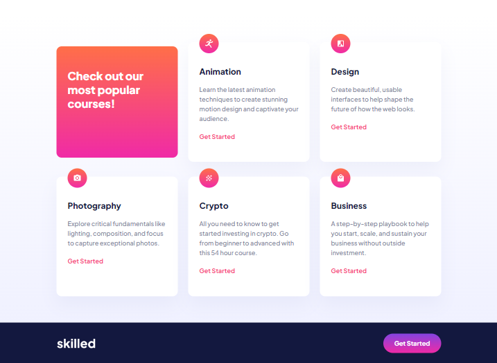

# Skilled-e-learning-landing-page

# Frontend Mentor - Skilled e-learning landing page solution

This is a solution to the [Skilled e-learning landing page challenge on Frontend Mentor](https://www.frontendmentor.io/challenges/skilled-elearning-landing-page-S1ObDrZ8q). Frontend Mentor challenges help you improve your coding skills by building realistic projects.

## Table of contents

- [Overview](#overview)
  - [Screenshot](#screenshot)
  - [Links](#links)
- [My process](#my-process)
  - [Built with](#built-with)
  - [What I learned](#what-i-learned)
- [Author](#author)

## Overview

### Screenshot

### Links

- Solution URL: [Add solution URL here](https://github.com/Itsmeelo/Skilled-e-learning-landing-page)
- Live Site URL: [Add live site URL here](https://itsmeelo.github.io/Skilled-e-learning-landing-page/)

## My process

### Built with

- Semantic HTML5 markup
- CSS custom properties
- Flexbox
- CSS Grid
- Responsive design

### What I learned

-Markdown
-HTML5
-CSS
-Responsive design

## Author

- Linkedin - [Elena Kuparadze](https://www.linkedin.com/in/elena-kuparadze-5a0a8660/)
- github - [@itsmeelo](https://github.com/Itsmeelo)
